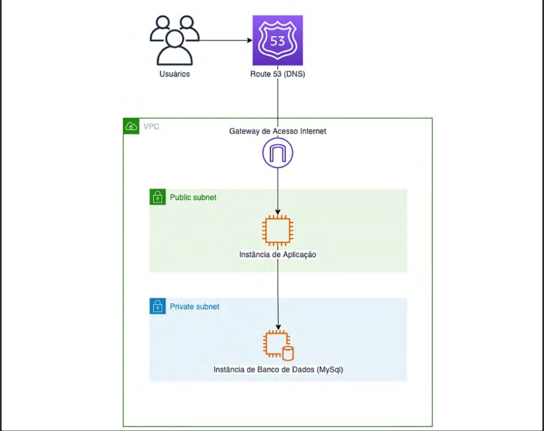

# terraform-firstcloudsystem
Let's start a new architecture to improved in the next lessons. 

## Architecture

## Image Description
VPC (Virtual Network) with a public and private subnet.
Internet Gateway for public subnet access.
Public Subnet with a NestJS application instance.
Private Subnet with a MySQL database instance.
Route 53 (DNS) equivalent in Azure (using Azure DNS).